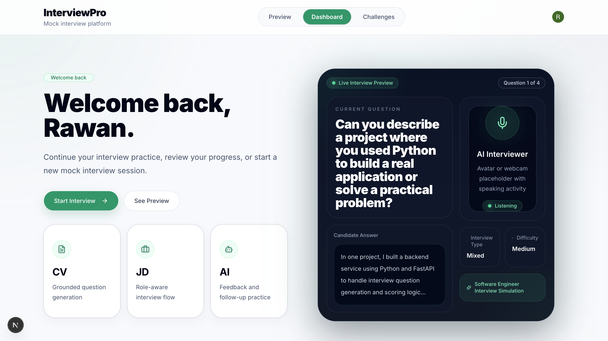

# Real-Time Interview Simulator

Real-Time Interview Simulator is a web application for practicing interviews, completing role-based challenges, and receiving structured feedback.

The app helps students, graduates, and job seekers prepare for real interviews by giving them a place to practice answers, review scores, and track improvement over time.

The system uses Clerk for authentication, Firebase/Firestore for storing user results, and a hybrid scoring pipeline for feedback generation.

---

## How it works

The user signs in, starts an interview session or opens a challenge, and submits an answer. The response is then sent through an evaluation pipeline that checks the quality of the answer and returns a score with feedback.

Clerk handles authentication and user sessions, while Firebase/Firestore stores interview attempts, challenge results, scores, and feedback history.

The evaluation focuses on:

- relevance to the question
- clarity of explanation
- completeness
- structure
- expected key points
- overall answer quality

The system uses a rule-based baseline, trained local models, and a semantic evaluation layer to evaluate answers and generate useful feedback.

---

## Getting started

### Prerequisites

Make sure you have the following installed:

- Node.js
- npm
- Git

You also need environment variables for:

- Clerk authentication
- Firebase/Firestore storage
- feedback API access for semantic answer evaluation

---

### Clone the repository

```bash
git clone https://github.com/Joseph-CH7/EECE490Project.git
cd EECE490Project
```

---

### Install dependencies

```bash
npm install
```

---

### Set up environment variables

Create a `.env.local` file in the root folder of the project:

```bash
touch .env.local
```

Add the required environment variables inside `.env.local`:

```env
# Clerk Authentication
NEXT_PUBLIC_CLERK_PUBLISHABLE_KEY=your_clerk_publishable_key_here
CLERK_SECRET_KEY=your_clerk_secret_key_here

# Feedback API
GEMINI_API_KEY=your_gemini_api_key_here

# Firebase
NEXT_PUBLIC_FIREBASE_API_KEY=your_firebase_api_key_here
NEXT_PUBLIC_FIREBASE_AUTH_DOMAIN=your_firebase_auth_domain_here
NEXT_PUBLIC_FIREBASE_PROJECT_ID=your_firebase_project_id_here
NEXT_PUBLIC_FIREBASE_STORAGE_BUCKET=your_firebase_storage_bucket_here
NEXT_PUBLIC_FIREBASE_MESSAGING_SENDER_ID=your_firebase_messaging_sender_id_here
NEXT_PUBLIC_FIREBASE_APP_ID=your_firebase_app_id_here
```

Important:

- Clerk keys are required for sign-in, sign-up, and user sessions.
- Firebase keys are required for storing and retrieving saved results.
- The feedback API key is required for semantic answer evaluation.
- Without valid environment variables, authentication, saved results, or AI feedback may not work correctly.

---

### Run the app

```bash
npm run dev
```

Open the app in your browser:

```txt
http://localhost:3000
```

---

### Run with Docker

The Docker setup runs the application as two services:

- `frontend`: the Next.js user interface on port `3000`
- `ml-api`: the FastAPI ML service on port `8000`

Make sure `.env.local` contains the required Clerk, Firebase, and feedback API keys, then run:

```bash
docker compose --env-file .env.local up --build
```

Open the app in your browser:

```txt
http://localhost:3000
```

The frontend calls the ML API through the internal Docker service URL:

```env
ML_SERVICE_URL=http://ml-api:8000
```

For local non-Docker development, the app falls back to:

```env
ML_SERVICE_URL=http://localhost:8000
```

---

## App overview

The home page gives users access to the main interview practice flow, the challenge section, and the dashboard.



Users can choose between practicing a real-time interview or completing additional challenge-based assessments.

---

### Authentication

The application uses Clerk to manage user authentication.

Users can sign in or create an account before using the platform. This allows the app to connect interview attempts and challenge results to the correct user.

Clerk is responsible for:

- user sign-up
- user sign-in
- session management
- protecting user-specific pages
- connecting saved results to the authenticated user

---

### Interview practice

The interview practice flow allows users to answer structured interview questions.

Supported question types include:

- technical questions
- behavioral questions
- HR questions
- problem-solving questions

After the user submits an answer, the system evaluates the response and generates feedback.

---

### Challenges

The challenges section gives users additional tasks that simulate practical interview assessments.

Challenges are designed to test:

- technical reasoning
- structured thinking
- decision-making
- written explanation
- role-specific problem solving

Each challenge result is saved so the user can review it later.

---

### Results and feedback

After completing an interview or challenge, the user receives a score and structured feedback.


The feedback may include:

- strengths
- missing points
- clarity issues
- relevance issues
- improvement suggestions
- overall readiness level

The goal is not only to give a number, but to explain how the user can improve.

---

### Dashboard

The dashboard stores previous interview sessions and challenge attempts.

Users can use the dashboard to:

- review past interviews
- review completed challenges
- open previous feedback pages
- compare scores
- track progress over time

Saved results are stored in Firebase/Firestore and linked to the authenticated user.

---

## Data storage

Firebase/Firestore is used to store user activity and saved results.

The app stores information such as:

- interview attempts
- challenge attempts
- user answers
- generated scores
- feedback
- completion dates
- user-specific history

This allows users to return to the dashboard and review previous attempts instead of losing their results after each session.


---

## Machine learning approach

The machine learning task is to support interview preparation through resume category prediction, question type classification, role-aware question selection, and answer feedback.

The system can treat this as:

### Regression

The model predicts a numerical score from 0 to 100.

```txt
User answer -> feedback score
```

### Classification

The model predicts an answer quality label.

Example labels:

- Weak
- Acceptable
- Strong

The model evaluates answers based on features such as relevance, completeness, clarity, structure, and expected key points.

---

## Why use ML?

A simple rule-based system can check answer length, keyword overlap, and basic structure. However, interview answers can be written in many different valid ways.

Two users may give different answers that are both correct. A rule-based system may fail if the answer does not use the exact expected keywords.

Machine learning is useful because it can learn patterns from labeled examples and better handle:

- different wording
- partial answers
- strong answers with varied structure
- weak answers that sound polished but miss the main point
- correct answers that do not match exact keywords

---

## Baseline and model

The baseline checks:

- answer length
- keyword overlap
- presence of expected concepts
- basic structure
- completeness indicators

The hybrid scoring pipeline improves on this by evaluating the full answer and generating structured feedback.


Possible model approaches include:

- TF-IDF + Logistic Regression
- TF-IDF + Ridge Regression
- Sentence Embeddings + Regression
- Sentence Embeddings + Classification Model

---

## Error analysis

The system was tested on different types of answers to understand where it performs well and where it fails.

Common error cases include:

- long but vague answers receiving scores that are too high
- short but correct answers receiving scores that are too low
- answers using different wording from the expected points
- polished answers that sound professional but do not answer the question
- partially correct answers that miss important details

This analysis helps identify where the system needs more labeled data, better features, or improved model calibration.

---

## Responsible ML

This project gives feedback that may influence how users judge their interview readiness, so responsible ML is important.

More detail is available in [docs/RESPONSIBLE_ML.md](docs/RESPONSIBLE_ML.md).

### Explainability

The app provides feedback with the score so users understand why their answer was evaluated in a certain way.

### Fairness and bias

The model should avoid unfairly penalizing users because of writing style, language background, or non-native English phrasing.

### Privacy

Interview answers may include personal experiences, education, work history, skills, or career goals.

The app uses authenticated sessions and user-specific storage so results are connected to the correct user. User responses should be handled carefully and should not be reused without permission.

### Robustness

The system should be tested on different answer styles, including short, detailed, vague, off-topic, partially correct, and differently worded answers.

---

## Limitations

The project has some limitations:

- the dataset size is limited
- answer quality can be subjective
- the model may struggle with unusual wording
- the system may overvalue long answers
- some short answers may be correct but under-scored
- API-based features depend on valid API access and quota availability
- authentication depends on valid Clerk configuration
- saved results depend on valid Firebase/Firestore configuration
- feedback may not always match expert human judgment

---

## Project documentation

- [Architecture](docs/ARCHITECTURE.md)
- [Results and evidence](docs/RESULTS.md)
- [Responsible ML](docs/RESPONSIBLE_ML.md)
- [Demo script](docs/DEMO_SCRIPT.md)

---

## Future work

Possible future improvements include:

- expanding the dataset with more labeled answers
- improving the scoring model with stronger embeddings
- adding company-specific interview modes
- adding voice-based interviews
- adding personalized study recommendations
- adding Docker support
- adding cloud deployment
- adding instructor/admin review mode
- adding more fairness and robustness tests
- improving Firebase data structure for better analytics
- adding admin analytics for instructors or career centers

---

## Disclaimer

Real-Time Interview Simulator is intended for interview practice and educational use. The feedback generated by the app may not always be fully accurate and should not be treated as a final judgment of a user’s interview ability.

Users should treat the feedback as guidance for improvement, not as a replacement for expert human feedback.
